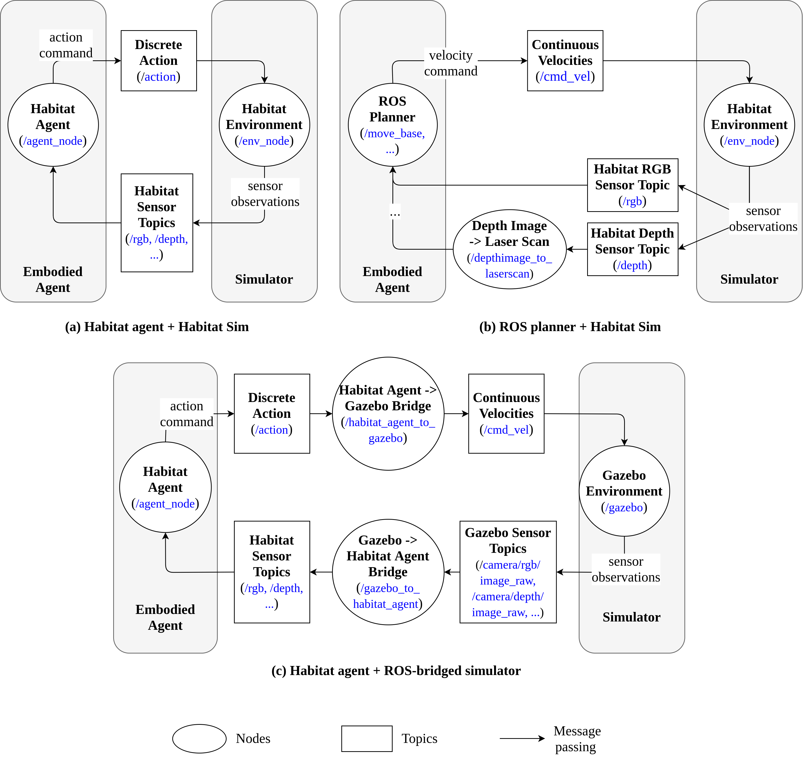

ros_x_habitat
==============================

A ROS package to bridge [AI Habitat](https://aihabitat.org/) with the ROS ecosystem.

## Outline
   1. [Motivation](#motivation)
   1. [System Architecture](#architecture)
   1. [Installation](#installation)
   1. [Examples](#examples)
   1. [Cite Our Work](#cite-our-work)
   1. [License](#license)
   1. [Acknowledgments](#acknowledgments)
   1. [References](#references-and-citation)

## Motivation
The package allows roboticists to
   * Navigate an AI Habitat agent within photorealistic scenes simulated by Habitat Sim through ROS;
   * Connecting a ROS-based planner with Habitat Sim;
   * Connecting an AI Habitat agent with a ROS-bridged simulator ([Gazebo](http://gazebosim.org/) for example) through ROS.
   * Leverage Habitat Sim's photorealistic and physically-realistic simulation capability through ROS.

## System Architecture
``ros_x_habitat`` exists as a collection of ROS nodes, topics and services. For simplicity, we have omitted components not essential to the interface's operation:



## Installation
1. Install Ubuntu 20.04 + ROS Noetic.
2. Install [Anaconda](https://www.anaconda.com/). 
3. Install [Habitat Sim](https://github.com/facebookresearch/habitat-sim) following the official instructions. Note that
    * We suggest you to use the version tagged `0.2.0`. Any versions below this is not supported;
    * We also suggest install by building from the source;
    * Install with Bullet Physics;
    * If you have an NVIDIA card, we suggest you to install with CUDA.
4. Install [Habitat Lab](https://github.com/facebookresearch/habitat-lab) in the same conda environment following the official instructions. Note that
    * We suggest you to use the version tagged `0.2.0`. Any versions below this is not supported;
    * In addition to the core of Habitat Lab, also install `habitat_baselines` and other required packages.
5. Install the following ROS packages:
   * `ros-noetic-depthimage-to-laserscan`
   * `ros-noetic-laser-scan-matcher`
   * `ros-noetic-rtabmap-ros`
   * `ros-noetic-joy`
6. Clone the repo to your catkin workspace.
7. Compile the package by calling `catkin_make`.
8. Export the repo's directory to `$PYTHONPATH`:
   ```
   export PYTHONPATH=$PYTHONPATH:<path-to-the-root-directory-of-the-repo>
   ```

## Examples
Here we outline steps to reproduce experiments from our paper.

### Navigating Habitat Agent in Habitat Sim without ROS (+/-Physics, -ROS)
We can attempt to reproduce experiments from the [Habitat v1 paper](https://arxiv.org/abs/1904.01201) by evaluating a Habitat agent's performance in a MatterPort3D test scenario. Note that unlike what the authors did in the paper, we used
   * Agents: [Habitat v2's RGBD agent](https://dl.fbaipublicfiles.com/habitat/data/baselines/v1/habitat_baselines_v2.zip) since the v1 agents are no longer compatible with Habitat v2;
   * Test episodes and scenes: MatterPort3D test episodes only. To get episode definitions, download from [here](https://dl.fbaipublicfiles.com/habitat/data/datasets/pointnav/mp3d/v1/pointnav_mp3d_v1.zip); to download the scene assets, please follow instructions from [here](https://niessner.github.io/Matterport/);
   * Also we evaluated the agent in physics-enabled Habitat Sim v2.

To run an evaluation, follow these steps:
   1. Create directory `data/` under the project's root directory. Then create the following directories:
      * `data/checkpoints/v2/`,
      * `data/datasets/pointnav/mp3d/v1/`,
      * `data/objects/`,
      * `data/scene_datasets/mp3d/`.
   2. Extract the v2 agents (`.pth` files) to `data/checkpoints/v2/`. Extract the MP3D episode definitions to `data/datasets/pointnav/mp3d/v1/` (then under `v1/` you should see directory `test/`, `train/`, etc). Extract the MP3D scene files to `data/scene_datasets/mp3d/`.
   3. Select an experiment configuration file from `configs/`. Our configurations are coded by numbers:
      * Setting 2: -Physics, -ROS;
      * Setting 4: +Physics, -ROS.
   4. Select from `seeds/` a seed file or create one of your own for your experiment. The seed is used for initializing the Habitat agent.
   5. Run the following command to evaluate the agent over the test episodes while producing top-down maps and box plots to visualize metrics:
      ```
      python src/scripts/eval_and_vis_habitat.py --input-type rgbd --model-path data/checkpoints/v2/gibson-rgbd-best.pth --task-config <path to config file> --episode-id <ID of last episode evaluated; -1 to evaluate from start> --seed-file-path <path to seed file> --log-dir <path to dir storing evaluation logs> --make-maps --map-dir <path to dir storing top-down maps> --make-plots --plot-dir <path to dir storing metric plots>
      ```

### Navigating Habitat Agent in Habitat Sim with ROS (+/-Physics, +ROS)
Coming soon

### Navigating Habitat Agent in Gazebo
Coming soon

### Navigating ROS Agent in Habitat Sim
Here we outline steps to control a ROS agent with RGBD sensors via a joystick in a Habitat Sim-simulated scene.
   1. Repeat Step 1 and 2 from [here](#Navigating-Habitat-Agent-in-Habitat-Sim-without-ROS-(+/-Physics,--ROS)) to download MP3D scene assets and episode definitions.
   2. Download Habitat's test object assets into `data/objects/` by running this command from Habitat Sim (more instructions from [here](https://github.com/facebookresearch/habitat-sim/tree/v0.2.0#testing)):
      ```
      python -m habitat_sim.utils.datasets_download --uids habitat_example_objects --data-path <path to ros_x_habitat/data/objects/>
      ```
   3. Start `roscore`.
   4. Select a configuration file from `configs/roam_configs/`. Here we select `pointnav_rgbd_roam_mp3d_test_scenes.yaml` since we only have downloaded the MP3D test scenes. You might want to change `VIDEO_DIR` to some directory of your liking.
   5. Run this command:
      ```
      python src/scripts/roam_with_joy.py --hab-env-config-path <config file path> --episode-id <ID of episode to roam inside> --scene-id <path to the episode's scene file, e.g. data/scene_datasets/mp3d/2t7WUuJeko7/2t7WUuJeko7.glb> --video-frame-period <number of continuous steps for each frame recorded>
      ```

We will soon update steps to run a planner from `rtabmap_ros` in Habitat Sim.

## Cite Our Work
If you are interested in using ``ros_x_habitat`` for your own research, please cite [our (Arxiv preprint) paper](https://arxiv.org/abs/2109.07703):
```
@misc{chen2021rosxhabitat,
      title={ROS-X-Habitat: Bridging the ROS Ecosystem with Embodied AI}, 
      author={Guanxiong Chen and Haoyu Yang and Ian M. Mitchell},
      year={2021},
      eprint={2109.07703},
      archivePrefix={arXiv},
      primaryClass={cs.RO}
}
```

## License
This work is under the [Creative Commons](https://creativecommons.org/licenses/by/4.0/) CC BY 4.0 License.

## Acknowledgments
We would like to thank [Bruce Cui](https://github.com/brucecui97) from the Department of Mechanical Engineering at UBC for his initial work on ``ros_x_habitat``. Also,  we would like to appreciate the AI Habitat team from Facebook AI Research, including Prof. Dhruv Batra, Alex Clegg, Prof. Manolis Savva, and Erik Wijmans for their generous support throughout our development process.

## References
1. [Habitat: A Platform for Embodied AI Research.](https://arxiv.org/abs/1904.01201) Manolis Savva, Abhishek Kadian, Oleksandr Maksymets, Yili Zhao, Erik Wijmans, Bhavana Jain, Julian Straub, Jia Liu, Vladlen Koltun, Jitendra Malik, Devi Parikh, Dhruv Batra. IEEE/CVF International Conference on Computer Vision (ICCV), 2019.
2. [Habitat 2.0: Training Home Assistants to Rearrange their Habitat.](https://arxiv.org/abs/2106.14405) Andrew Szot, Alex Clegg, Eric Undersander, Erik Wijmans, Yili Zhao, John Turner, Noah Maestre, Mustafa Mukadam, Devendra Chaplot, Oleksandr Maksymets, Aaron Gokaslan, Vladimir Vondrus, Sameer Dharur, Franziska Meier, Wojciech Galuba, Angel Chang, Zsolt Kira, Vladlen Koltun, Jitendra Malik, Manolis Savva, Dhruv Batra. arXiv preprint arXiv:2106.14405, 2021.
3. [ROS-X-Habitat: Bridging the ROS Ecosystem with Embodied AI.](https://arxiv.org/abs/2109.07703) Guanxiong Chen, Haoyu Yang, Ian Mitchell. arXiv preprint arXiv:2109.07703, 2021.